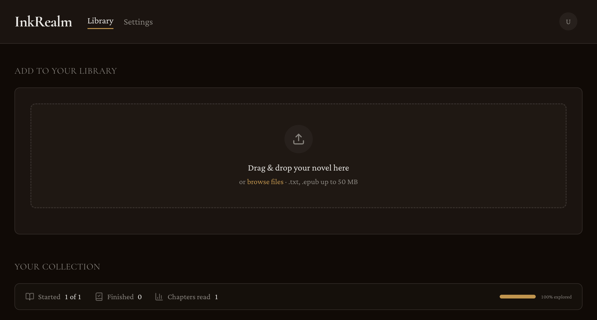
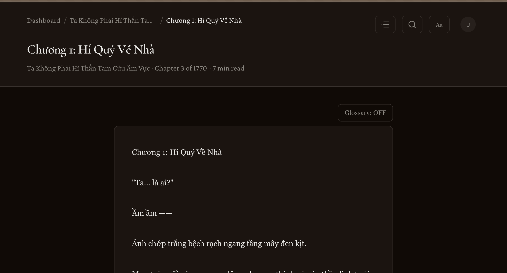

# InkRealm

**Your Personal Novel Sanctuary** — Upload, read, and translate novels with AI.

InkRealm is a self-hosted web application for managing a personal novel library. Upload `.txt` and `.epub` files, read them in a customizable in-browser reader, and translate them chapter-by-chapter using multiple AI providers — with glossary support for consistent terminology.

## Why I Built This

I wanted a self-hosted reading platform for personal novel collections that could do more than just store files. InkRealm brings together library management, a customizable reading experience, and AI-assisted translation workflows in one place.

---

## Preview

| Dashboard | Reader |
|-----------|--------|
|  |  |

---

## Features

### Novel Library

- Drag-and-drop upload for `.txt` and `.epub` files (up to 50 MB)
- Card-based gallery with reading progress indicators and cover art
- Novel detail pages with metadata — chapter count, word count, reading time, file size
- Secure per-user data isolation

### In-Browser Reader

- Full chapter navigation via table-of-contents drawer
- Customizable reading preferences — font size, font family (serif/sans), line height, content width, reader theme (light/dark)
- Automatic scroll position persistence across sessions
- Reading progress tracking with chapter visit history
- In-chapter text search with match highlighting
- Keyboard shortcuts for navigation, search, and settings
- Word count and estimated reading time per chapter

### AI Translation

- **5 providers** — OpenAI, Anthropic, DeepSeek, OpenRouter, MiniMax
- Multiple translation profiles per user with custom prompts and model selection
- Glossary system for consistent terminology — characters, places, techniques, with variant mappings
- Glossary preview and batch apply across translated chapters
- Sequential chapter translation with real-time progress polling
- Context-aware translation with chapter summaries and cross-chapter context
- Job management — retry failed chapters, cancel in-progress jobs
- EPUB export of completed translations
- API keys encrypted at rest with AES-256-GCM

### Authentication

- Email/password registration with bcrypt hashing
- Google OAuth with account conflict detection
- Password reset via email (Resend)
- OAuth account linking and unlinking
- 30-day database-backed sessions

### Settings

- Profile management (name, email)
- Password change and set (for OAuth-only accounts)
- Google account linking/unlinking
- Translation profile CRUD with default provider selection

---

## Tech Stack

| Layer | Technology |
|-------|------------|
| Framework | Next.js 16 (App Router) |
| UI | React 19, Tailwind CSS v4, shadcn/ui (base-nova) |
| Database | PostgreSQL via Prisma 7 |
| Auth | Auth.js v5 (NextAuth) |
| Email | Resend |
| Language | TypeScript 5 |
| Runtime | Node.js 20+ |

### Design System

- **Dark-first** — OKLch color palette with deep purple/gold accents
- **Typography** — Cormorant Garamond (headings) + Crimson Pro (body), Vietnamese support
- **Components** — shadcn/ui with Lucide icons, Sonner toast notifications
- **Light mode** available via theme toggle

---

## Getting Started

### Prerequisites

- Node.js 20+
- A running PostgreSQL instance

### Setup

1. **Install dependencies:**

   ```bash
   npm install
   ```

2. **Configure environment variables:**

   ```bash
   cp .env.example .env
   ```

   **Required:**

   | Variable | Purpose |
   |----------|---------|
   | `DATABASE_URL` | PostgreSQL connection string |
   | `AUTH_SECRET` | Auth.js session secret — generate with `npx auth secret` |
   | `TRANSLATION_ENCRYPTION_SECRET` | AES key for API key encryption — generate with `openssl rand -base64 32` |

   **Optional:**

   | Variable | Purpose |
   |----------|---------|
   | `AUTH_GOOGLE_ID` / `AUTH_GOOGLE_SECRET` | Google OAuth credentials |
   | `RESEND_API_KEY` / `RESEND_FROM_EMAIL` | Email delivery for password reset |

3. **Set up the database:**

   ```bash
   npx prisma migrate dev
   npx prisma generate
   ```

4. **Start the dev server:**

   ```bash
   npm run dev
   ```

5. Open [http://localhost:3000](http://localhost:3000) and create an account.

---

## Scripts

| Command | Description |
|---------|-------------|
| `npm run dev` | Start development server |
| `npm run build` | Production build |
| `npm run start` | Start production server |
| `npm run lint` | Run ESLint |
| `npm test` | Run all tests (unit + integration) |
| `npm run test:unit` | Unit tests only |
| `npm run test:integration` | Integration tests only |

---

## Project Structure

```
app/
  api/                          API routes
    auth/                       Register, login, password reset, OAuth
    novels/[novelId]/           Novel deletion
    reading/                    Preferences and scroll position
    translation/
      profiles/                 Translation profile CRUD
      novels/[novelId]/jobs/    Translation jobs
      novels/[novelId]/glossary/ Glossary CRUD + apply/preview
      jobs/[translationId]/     Status, cancel, retry, export
    uploads/                    File upload

  dashboard/                    Novel library page
  novels/[novelId]/             Novel details (info, translation, glossary tabs)
    read/[chapterIndex]/        Full-screen reader
  settings/                     Account + translation provider settings
  login/ register/              Auth pages
  forgot-password/ reset-password/

  lib/                          Business logic
    reader/                     TXT/EPUB parsing engine
    translation/
      adapters/                 Provider adapters (OpenAI, Anthropic, etc.)
      service.ts                Translation orchestration
      data.ts                   Prisma queries
      glossary.ts               Glossary data layer
      export.ts                 EPUB export
      crypto.ts                 API key encryption
    novels.ts                   Novel CRUD
    storage.ts                  File system I/O
    reading-progress.ts         Progress tracking
    reading-preferences.ts      Reader preferences

  components/                   Feature-specific client components
  generated/prisma/             Generated Prisma client

components/ui/                  shadcn/ui base components
prisma/schema.prisma            Database schema
storage/                        Uploaded files (gitignored)
```

---

## Database Schema

12 tables managed by Prisma:

```
User
  Account, Session              Auth.js identity + sessions
  Novel                         Uploaded novels
  TranslationProfile            AI provider configs (encrypted API keys)
  ReadingProgress               Per-novel reading position
    ChapterVisit                Per-chapter scroll tracking
  UserReadingPreferences        Font, theme, width settings

Novel
  NovelTranslation              Translation jobs
    NovelTranslationChapter     Per-chapter results
  NovelGlossaryEntry            Terminology glossary
    NovelGlossaryVariant        Variant spellings

VerificationToken               Password reset tokens
```

After any `schema.prisma` change:

```bash
npx prisma migrate dev
npx prisma generate
```

---

## API Reference

### Authentication

| Method | Endpoint | Description |
|--------|----------|-------------|
| POST | `/api/auth/register` | Email/password signup |
| POST | `/api/auth/forgot-password` | Request password reset |
| POST | `/api/auth/reset-password` | Reset password via token |
| POST | `/api/auth/set-password` | Set password (Google-only users) |
| POST | `/api/auth/change-password` | Change existing password |
| POST | `/api/auth/unlink-google` | Disconnect Google account |
| * | `/api/auth/[...nextauth]` | Auth.js handlers |

### Uploads

| Method | Endpoint | Description |
|--------|----------|-------------|
| POST | `/api/uploads` | Upload novel file (.txt / .epub) |

### Novels

| Method | Endpoint | Description |
|--------|----------|-------------|
| DELETE | `/api/novels/[novelId]` | Delete a novel |

### Reading

| Method | Endpoint | Description |
|--------|----------|-------------|
| PUT | `/api/reading/preferences` | Update reading preferences |
| POST | `/api/reading/scroll-position` | Save scroll position |

### Translation Profiles

| Method | Endpoint | Description |
|--------|----------|-------------|
| GET | `/api/translation/profiles` | List user's profiles |
| POST | `/api/translation/profiles` | Create profile |
| PATCH | `/api/translation/profiles/[profileId]` | Update profile |
| DELETE | `/api/translation/profiles/[profileId]` | Delete profile |
| PUT | `/api/translation/profiles/[profileId]/default` | Set as default |

### Translation Jobs

| Method | Endpoint | Description |
|--------|----------|-------------|
| GET | `/api/translation/novels/[novelId]/jobs` | Get latest job |
| POST | `/api/translation/novels/[novelId]/jobs` | Start translation |
| GET | `/api/translation/jobs/[translationId]/status` | Poll job progress |
| POST | `/api/translation/jobs/[translationId]/cancel` | Cancel job |
| POST | `/api/translation/jobs/[translationId]/retry` | Retry failed job |
| GET | `/api/translation/jobs/[translationId]/export` | Download EPUB |

### Glossary

| Method | Endpoint | Description |
|--------|----------|-------------|
| GET | `/api/translation/novels/[novelId]/glossary` | List entries |
| POST | `/api/translation/novels/[novelId]/glossary` | Create entry |
| PATCH | `/api/translation/novels/[novelId]/glossary/[entryId]` | Update entry |
| DELETE | `/api/translation/novels/[novelId]/glossary/[entryId]` | Delete entry |
| POST | `/api/translation/novels/[novelId]/glossary/[entryId]/apply` | Apply to translation |
| POST | `/api/translation/novels/[novelId]/glossary/[entryId]/preview` | Preview application |

---

## Pages

| Route | Description |
|-------|-------------|
| `/` | Landing page — hero with CTA |
| `/login` | Email/password + Google OAuth |
| `/register` | Account registration |
| `/forgot-password` | Password reset request |
| `/reset-password` | Token-based password reset |
| `/dashboard` | Novel library with upload, gallery, and reading stats |
| `/settings` | Account settings and translation provider management |
| `/novels/[novelId]` | Novel details — info, translation, and glossary tabs |
| `/novels/[novelId]/read/[chapterIndex]` | Full-screen reader |

---

## Translation Workflow

1. **Configure a provider** — Add a translation profile in Settings with your API key, model, and optional custom prompt.
2. **Start a translation** — On the novel detail page, open the Translation tab and start a job.
3. **Monitor progress** — Real-time chapter-by-chapter progress via polling.
4. **Manage glossary** _(optional)_ — Add glossary entries for characters, places, and techniques to ensure consistent terminology.
5. **Export** — Download completed translations as EPUB.

### Supported Providers

| Provider | Adapter Type | Examples |
|----------|-------------|----------|
| OpenAI | `openai-compatible` | GPT-4o, GPT-4 |
| Anthropic | `anthropic` | Claude 3.5 Sonnet, Claude 3 Opus |
| DeepSeek | `openai-compatible` | DeepSeek Chat |
| OpenRouter | `openai-compatible` | Multi-model access via one key |
| MiniMax | `openai-compatible` | MiniMax models |

---

## Security

- **Passwords** — bcrypt hashing with salt rounds
- **API keys** — AES-256-GCM encryption at rest, decrypted only when needed
- **Rate limiting** — Separate limiters for auth, API, uploads, and frequent requests
- **Sessions** — 30-day expiry, database-backed, HTTPOnly secure cookies
- **Input validation** — Email normalization, file type checks, payload validation, SQL injection prevention (Prisma)
- **CSRF** — Auth.js CSRF token protection

---

## Testing

Tests use the Node.js native test runner (`node:test`) with `tsx`:

```bash
npm test                # All tests
npm run test:unit       # Unit tests only
npm run test:integration # Integration tests only

# Single test file
npx tsx --test app/lib/translation/crypto.test.ts
```

Test coverage includes: translation profiles and lifecycle, state management, glossary operations, EPUB export, reader caching, input validation, encryption, and quality presets.

---

## License

Proprietary. All rights reserved.
